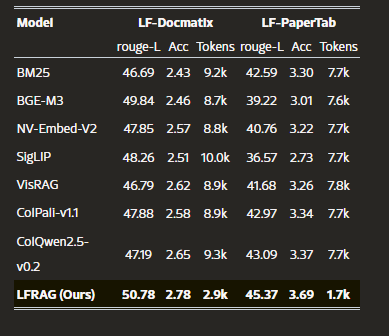
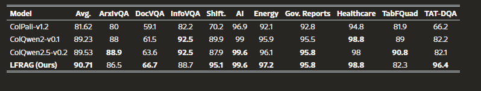

Öncelikle sistem incelememe konuya uygun olan makaleleri incelemek ile başladım. Bu konuda incelediğim makaleler şu şekilde;
-LocalRAG: A Privacy-Preserving Offline Framework for Multi-PDF Question Answering https://www.researchgate.net/publication/399649031_LocalRAG_A_Privacy-Preserving_Offline_Framework_for_Multi-PDF_Question_Answering/link/69631f6ec906f117f2a2e63a/download?_tp=eyJjb250ZXh0Ijp7ImZpcnN0UGFnZSI6InB1YmxpY2F0aW9uIiwicGFnZSI6InB1YmxpY2F0aW9uIn19  --->  RAG mimarisinin lokalde herhangi bir API'ye bağlı olmadan nası kurgulanabileceğini anlatmaktadır. Burada OCR ve BGE-small embedding modeli ile ilk defa karşılaştım. Daha önceden farklı embedding modelleri ile çalışmıştım fakat bu modeli duymamıştım. Bu 2 konuyu araştırmalıyım.  !!! Test ederken yalnızca PDF türündeki belgeler ile test etmemeliyim. Fazla resim içeren PDF, içeriğinde sorunun cevabı şekillendirilmiş resim, konudan bağımsız bir resim, el yazısı içeren bir döküman... Sistem resimi de analiz edebilmeli belgeden soru- cevap yapılabilecek bir resim içeriği de olabilir. Örn: Bir manzara resminde ağaçların konumu sorulabilir
OCR: Dökümanlardaki metinleri okuyup işlenebilir hale getirme işlemi
BGE-small: Metinleri 384 boyutlu vektöre dönüştüren model

-LFRAG: Layout-oriented Fine-grained Retrieval-Augmented Generation https://arxiv.org/html/2605.22829v1 ---> OCR'nin parçalı pdflerdeki yetersizliğini anlatıyor. Yükarıda test etmek istediğim seneryolarda değindiğim gibi görselli ve tablolu dökümanlarda anlam eksikliğine yol açıyor. Bunun için LFRAG yönteminin çok daha başarılı olduğu gözlemlenmiş. LFRAG dökümanı bir bütün olarak değilde parçalanmış nloklar halinde grupluyor. Bu gruplama sayesinde dökümandaki bütünlük sağlanıyor. Küçük font ile yazılmış bilgilendirici paragraf ayrı bir konu olarak da algılanabiliyor.
 

MAGE-RAG: Multigranular Adaptive Graph Evidence for Agentic Multimodal RAG in Long-Document QA https://arxiv.org/html/2606.15906v1 ---> Dökümani alt başlıklara ayırabilen bir ajan sistemi. Örneğin sayfalar, başlıklar, tablolar gibi alt başlıklar ile QA'yı hızlandııryor. En önemli noktaı bir K noktası vermiyor oluşu. Sabit bir k basit sorularda karmaşık cevaplar, karmaşık sorularda halisinasyon riskini arttırabilir.

VLM-RAG ---> Görseli anlamlandıran bir model. 

----
Bu noktada MARGE-RAG'da ki düğüm mantığı karmaşık sorular ve soru bağlamlarını çözme konusunda çok daha iyi fakat lokal modellerde devasa sorgular yapamayacağım için loopa girecektir. Bir diğer eksi noktası ise dökümandaki "resim2'de bahsettiğimiz gibi" şeklinde atıflar olduğunda bunu graf özelinde vermemiz gerekir fakat bizim dökümanımız anlık olarak değişebilir bizde bu grafı her defasında kurgulayamayız. 

OCR'nin tamamen eksik olduğunu düşünüyorum bu sebeple bu mimariyi diğerlerimne göre daha başarısız lkabul ettiğim içn denemeyeceğim. 

Bu aşamada LFRAG temelinde bir sistem geliştirmeyi düşünüyorum. Bu sisteme MARGE-RAG'da kullanılan graf ajan mantığını temel düzeyde entegre etmeye çalışacağım. Görselleri de VLM-RAG ile anlamlandırabileceğimi düşünmekteyim. 

---
Kodlamama öncelikle LFRAG ile konumlandırma yaptığı ve dökümanları bloklandırdacağı şekilde başlıyorum.

Kodlama aşamasında dökümandaki görsellerin başarılı şekilde ykalandığını fakat tabloların yakalanmadığını gördüm.
Çözüm-> PyMuPDF'ın find_tables() fonsiyonunu kullanacağız.
Tabloları yakalayamamasının sebebi dökümanın kaynak kodunda resimler "XObject" adında paketlerde tutulur tablolar bu paketlerde yer almaz. Birer resim değildirler. Sistem onları çizgileri boşlukları ayarlanmış bağımsız metin parçaları olarak görür.
!!Sistem matematiksel formülleri düz metin olarak algılamaktadır. Dikey çizgisi olmayan tablo ve yoğun vktörel çizgi içeren şemalarda sınırları yanlış hesaplamaktadır.

Çözüm olarak pdfplumber kullandım fakat bunun daha başarısız olduğunu tespit ettim.

Pdf'in her sayfasında yer alan madde imleri her defasında görsel olarak algılandığı tespit edildi. Çözüm olarak genişlik ve yükseklik kontrolü yapılacak. 

Genişkil ve yükseklik kontrolü yapıldığında tasarımcının görsellerin arka planına koyduğu düz resimleri de yakalamaktadır. Bunun için renk değişimini kullanacağım arka planlarda standart sapma sıfıra yakındır fakat görselde bir nesne varsa renk geçişi çok yüksektir bunu kullanacağım.

Bu yöntemle bir çok arka plan görselinden kurtuldum fakat hala gereksiz görseller mevcut. Bunu çözmek için OpenCV kullanmayı tercih edebilirdim fakat buradaki hasas ayar her bir pdf'de değişeceği için başarılı bir yöntem olacağını düşünmüyorum. Bunu LLM promptunda çözmek bu proje özelinde çok daha mantıklı.

Görsellerin anlamlandırılmasına geçebiliriz Lema lokal modeli basit bir resim için türkçe dilinde çok başarısız kaldı.

Sistem geliştirmesi sonunda teknik bir konu olduğunda cevaplayabildiğini fakat anlamsal bir şey olduğunda cevaplayamadığını gördüm. Örneğin belgede neyden bahsedilmektedir gii sorularda yetersiz kalmaktadır. -> Bunun sebebi mimarimizde birbiriyle alaklaı kısımları bölümlendrimesi fakat bir bütün olarak değerlendirememesidir.

Bunun için farklı yöntemler vardır:
1. Node olarak sistemin özetine bağlamak. Bu bana mantıksız geldi. Çünkü "Sistem ne anlatıyor" sorusu sorulduğunda genel bir özet bekleriz. Fakat "Vektörel veri tabanı sistemi ne anlatıyor" sorusu sorulduğunda vektörel veri tabanının ne anlattığıı sorarız. Fakat bu mimarideki sistem bu soru farkını anlamaz ve özet verir. Vektörel db özelliğini kullanamamış oluruz.
2. LLM ile çözmek. İşlemciye aşırı yüklenip maliyeti arttırıp zamanı çoğaltmak istememekteyim. 

Karşılaştığım problemin ismi "Global vs. Local Query Routing"

Bunun için çözümün ismi "İki Katmanlı İndeksleme ve Otomatik Profilleme" başlık yapılarından genel bir özetleme yapan bir sistem kullandım. Başlıklardan özet çıkardığımız bu sistem belgenin tümüne bakarak o belenin parmak izi niteliğinde bir özet çıkartır. 

Bu şekilde özetlemenin yine yetrsiz kaldığını tespit ettim. Örneğin sistemin genel özeti güzel bir şekilde açıklanıyor fakat spesifik olmayan bir soru "Dönüşüm hakkındaki düşünce nedir?" gibi detay içermeyen ama özette sormayan sorularda bu yöntem yetrsiz kalıyor. Bunun için bir ağaç mantığı kullanmak daha kullanışlı geldi. Gövde bir bilgi, dallar, yapraklar gibi daha sistematik bir yapı. Bu şekilde yaptığımda sistemim gerçekten başarı oranı arttı.

Kendi lokalimde denemeler yaparken vektörel db ile ilgili bir hata tespit ettim. Cevaplar eksik geliyordu bunun için başka vektörelleştirme sistemlerininde olduğunu keşfettim. BAAI/bge-m3'i kullandığımda sistemin daha başarılı olduğunu test ettim. Hatta karşılaştırma yaptığım terminal çıktısını da TESTING.md dosyasına ekledim. Bu çıktıda şunu anladım. Kasinüs uzunluğu diğer kullandığım modelde çok daha yüksek çıkmasına rağmen sistem yanlış noktaya gidiyordu ve halisinasyon görme ihtimalini arttırıyordu. Bunun için BAAI/bg-m3 ile devam ettim. İki sistemi araştirdiğimda bu temel fark ViT-B-32in daha küçük parçalamalar yapması olduğunu buldum. Küçük parçalamalar bizim anlam bütünlüğümüzü bozmaktadır. 

LLM kalitemizi arttırmak için bir diğer yaptığım araştırma ise kullandığım LLM çeşitinin altarnatiflerini aramaktı. Bu araştırmanın sonundaysa llama3 yerine qwen'i kullandım. Bu test sonundaysa qwen'in fark edilebilir derecede iyi yanıtlar ürettiğini ve bağlamı daha iyi çözdüğünü gördüm. Bu karşılaşmayı yaparken önceliğim türkçe dilinde mantıklı cevaplar alabilmekti. İngilizce dilinde çoğu LLM gayet iyi bir şekilde çalışmaktadır zaten.

Bu süreçte en zorlandığım nokta sistemin çalışması için API yerine lokali tercih etmemdi. Sistem lokalde çalıştığı için test sürelerim oldukça uzun sürdü. Fakat genel bir test yapmadan 2 3 soru sorarak sistemin başarısını onaylamak istemedim. 